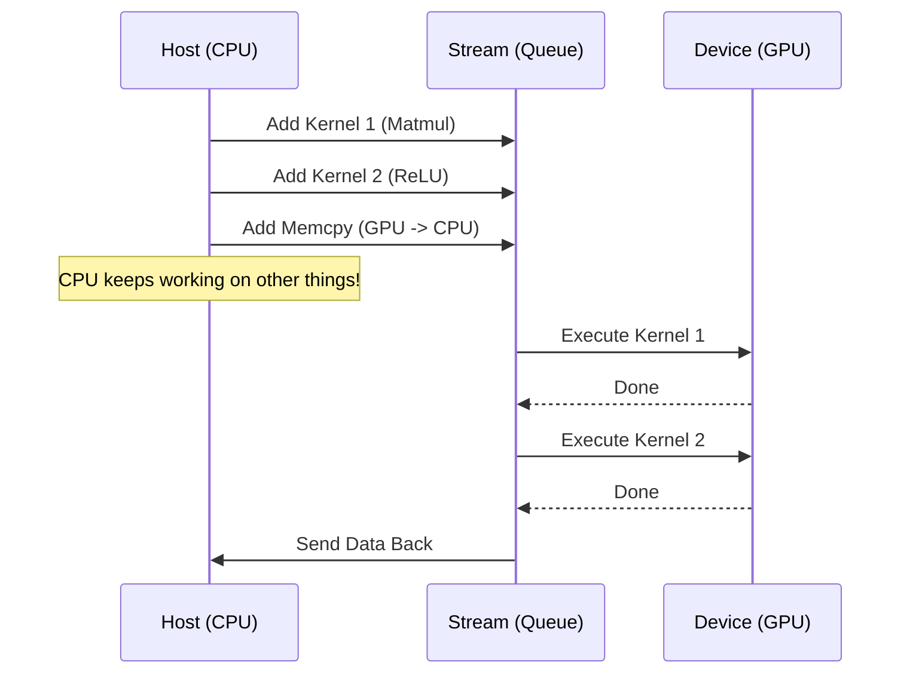

# Deep Dive: Unified Host-Kernel Orchestration

This document explains the "Behind the Scenes" mechanics of how the **Host (CPU)** and the **Device (GPU)** work together as a single unified system to execute your compiled model.

---

## 1. Internal Architecture: The "Split"

When you compile a model for GPU, the compiler produces a **Heterogeneous Binary**. 

### The Host Side (CPU Control Logic)
The CPU code is the "Orchestrator." Its job is:
1.  **Memory Management**: Allocating GPU buffers (using `cudaMalloc`).
2.  **Data Transfer**: Copying data from CPU $\rightarrow$ GPU (`cudaMemcpy`).
3.  **Kernel Queueing**: Telling the GPU driver which tasks to put in the line.
4.  **Synchronization**: Waiting for the GPU to finish before reading results.

### The Device Side (GPU Kernel)
The GPU code (the PTX we generated) contains NO logic for memory management or file I/O. It only knows how to:
1.  Read from a specific memory address (pointer).
2.  Perform the math.
3.  Write to a specific memory address.

---

## 2. Shared Responsibility Flow (Step-by-Step)

Here is exactly what happens in memory and hardware during a `CompiledKernel.run()` call:

### Step 1: Preparation (Host)
The Host code (CPU) calculates the **Grid and Block sizes**. 
*   If your Tensor has 1,000,000 elements, the Host decides: "I will launch 1,000 blocks with 1,024 threads each."

### Step 2: The Marshaling (The Bridge)
This is the most critical part. The Host packs the "Kernel Arguments" into a buffer.
*   **The Problem**: The GPU doesn't know what an `ag::Tensor` is. 
*   **The Solution**: The Host extracts the **Device Pointer** (the raw `void*` sitting on the GPU) and puts it in an array.

```cpp
// Logic inside your NovaExecutor
void* args[] = { &inputPtr, &weightPtr, &outputPtr, &size };
```

### Step 3: The Launch (Asynchronous)
The Host calls `cuLaunchKernel`. This is **non-blocking**! 
*   The CPU sends the command and the `args` to the GPU's **Command Queue**.
*   The CPU immediately moves to the next line of code (it doesn't wait).

### Step 4: Execution (Device)
The GPU reads the command, pulls the `args` into its internal registers, and starts its thousands of threads.

### Step 5: Synchronization (The Re-Join)
At some point, the Host needs the result. It calls `cudaStreamSynchronize` or `cudaMemcpy`. This is where the flow becomes "ONE" again. The CPU pauses and waits until the GPU worker yells "DONE."

---

## 3. Communication Pattern: Streams

To keep the flow unified and fast, we use **CUDA Streams**.

*   Instead of the CPU waiting for every single kernel, it queues up **all** kernels for a specific model layer onto one stream.
*   The GPU worker finishes Task A and immediately starts Task B without asking the CPU for permission.



---

## 4. Why this is "Unified"
Even though the binaries are different (Object vs PTX), the **Execution Timeline** is continuous. 

In your implementation:
1.  `nova-translate` embeds the PTX inside the CPU Object file.
2.  When the `cgadimpl` graph executes, it doesn't see "GPU math" vs "CPU math." 
3.  It sees a `Node`, and that node has a `CompiledFunction`. 
4.  The `NovaExecutor` abstracts away all the complexity of streams, pointers, and synchronization.

**Your final result**:
A single function call: `compiled_model.forward(inputs)` runs everything across both hardware units seamlessly.
