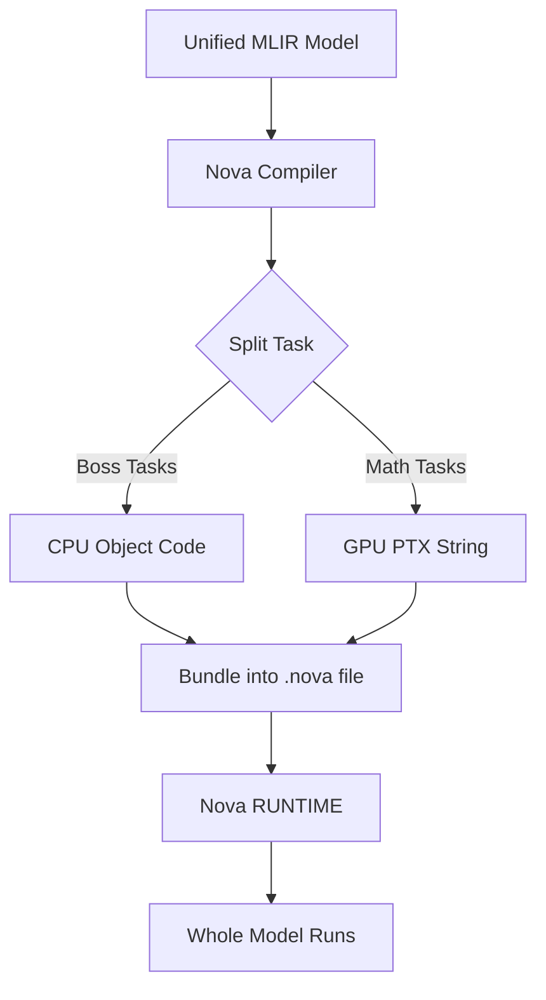

# The Unified Execution Flow: Host & Kernel

You are correct that there is **one overall flow**, but there are **two different files** generated because of how computers work: the **CPU (The Boss)** and the **GPU (The Worker)** are two separate pieces of hardware.

---

## 1. Why Two Paths? (The Concept)
Think of a model execution like a **Construction Site**:
*   **The CPU (The Boss/Host)**: Stays in the office, manages the schedule, and gives orders. It needs a standard program (Object Code).
*   **The GPU (The Worker/Device)**: Does the heavy lifting (Matmuls). It speaks a different language and needs a list of tasks (PTX Code).

Even if you have one MLIR model, the compiler has to "split" it:
1.  The **Outer Logic** (loops, memory allocation) $\rightarrow$ CPU Object Code.
2.  The **Heavy Math** (the kernel) $\rightarrow$ GPU PTX.

---

## 2. The Unified Flow: How they become ONE

In your `nova-translate` tool, you don't call two different programs. You have one **Unified Pipeline** that handles the split automatically.

### The "Bundle" (Fat Binary) Theory
We combine the CPU code and the GPU instructions into a single file called a **Fat Binary** or a **Model Package**.

### Unified Code Logic (C++)
This is how your compiler handles it in a single flow:

```cpp
void NovaTranslate(mlir::ModuleOp module, TargetArch target) {
    auto llvmModule = translateMLIRToLLVM(module);
    
    // ONE FLOW: Use the Target to decide the backend
    if (target == Target::NVIDIA_GPU) {
        // 1. Generate PTX string
        std::string ptx = emitGPUBackend(llvmModule);
        // 2. Wrap it inside the CPU Host code so the Boss knows how to load it
        embedPTXInsideObjectFile(ptx); 
    } else {
        // Just generate CPU code if no GPU is needed
        emitCPUBackend(llvmModule);
    }
}
```

---

## 3. What happens at Runtime? (The Unified Step)

When you run your model in `cgadimpl`, you only call **ONE thing**: `NovaExecutor::run()`.

1.  **Loading**: The Executor loads your single "Model File."
2.  **Dispatching**:
    *   It starts running the **CPU code** immediately.
    *   When the CPU code reaches a line that says "Run GPU Math," it automatically sends the **embedded PTX** to the GPU.

### Simple Visualization


---

## 4. Key Takeaway for you
You will write **one tool** (`nova-translate`). It will take your MLIR and output **one file**. 

Inside that one file, the compiler has cleverly hidden the GPU instructions so that the CPU can find them and hand them to the worker at exactly the right time. This is exactly how CUDA (nvcc) and PyTorch Inductor work!
